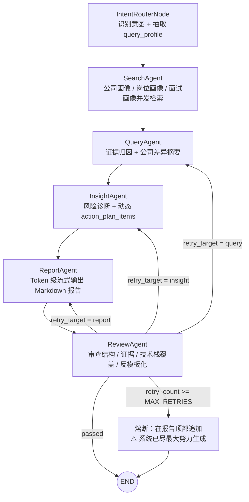

# BettaFish LangGraph 求职研究助手

一个本地可运行的、面向单次深度调研的 LangGraph 求职研究助手。

当前版本已经升级为确定性工作流：

- `IntentRouterNode` 先识别用户侧重点
- `SearchAgent` 再按意图并发调度本地 Tools 检索真实证据
- `QueryAgent` / `InsightAgent` 输出结构化分析
- `ReportAgent` 以 token 级方式流式生成 Markdown 报告
- `ReviewAgent` 负责审查、回退和熔断

系统目标不是做多轮记忆聊天，而是围绕一次明确的“公司 + 岗位 + 研究目标”，完成一轮高强度、可追溯、可导出的深度调研。

二阶段已补齐一层 Harness Engineering 外壳：

- 每次 run 都会生成 `run_id`
- `/api/research/run` 与 `/api/research/stream` 共享统一 trace / quality summary 口径
- `evidence_items` 成为下游优先证据契约，`context` 仅保留兼容展示层
- 新增固定 `research case` 与离线/接口评测入口，用于回归和复现

## 架构图



## 核心设计

### 1. 确定性状态机

后端统一由 LangGraph `StateGraph` 驱动：

```python
class AgentState(TypedDict):
    query: str
    intent: str
    query_profile: Dict[str, Any]
    context: Annotated[List[str], operator.add]
    insights: Dict[str, Any]
    report_content: str
    review_feedback: str
    retry_count: int
    status: str
```

其中：

- `intent` 保存意图路由结果
- `query_profile` 保存公司、岗位、团队方向、业务域和优先主题
- `context` 保存并发检索回来的硬核事实，每条证据块都带 `SOURCE_CLASS` 和 `RELEVANCE_HINT`
- `insights` 保存 Query / Insight 的结构化输出
- `review_feedback` 保存 ReviewAgent 的 JSON 审查结果
- `retry_count` 控制回退次数与熔断

### 2. Tools 层解耦

所有网络检索能力都下沉到 `api/tools/`，不再把 HTTP 请求写死在 `SearchAgent` 内部。

当前工具包括：

- `company_profile_searcher.py`
- `jd_searcher.py`
- `interview_searcher.py`
- `tech_stack_searcher.py`
- `salary_culture_searcher.py`
- `tavily_searcher.py`

这些工具都是纯异步 Python 函数，不依赖 LLM，也不走模型自主工具选择。

`SearchAgent` 不只按 `intent` 选工具，也会根据 `query_profile` 生成更细的 query pack。它会固定检索三类画像：

- 公司画像：业务线、组织特征、产品场景、技术文化、招聘页
- 岗位画像：JD、职责、任职资格、关键技术栈
- 面试画像：真实面经、高频问题、系统设计、算法/项目追问

调度逻辑固定写在 `SearchAgent` 中：

- `general`：`company_profile_searcher + jd_searcher + interview_searcher`
- `tech_coding`：`company_profile_searcher + jd_searcher + interview_searcher + tech_stack_searcher`
- `salary_culture`：`company_profile_searcher + jd_searcher + interview_searcher + salary_culture_searcher`

然后再做确定性重排：

- 优先保留命中公司名 / 团队方向 / 业务域的证据
- 优先保留更近的结果
- 优先保留 JD / 招聘页 / 高质量面经页
- 限制泛经验贴占比，避免 context 被通用内容淹没

### 3. Token 级流式输出

`ReportAgent` 使用 `streaming=True` 调用模型。

后端流式接口 `/api/research/stream` 基于 LangGraph `astream_events(version="v2")`：

- 节点开始时发送 `status`
- `ReportAgent` 在 `on_chat_model_stream` 时发送 `chunk`
- 节点结束时发送 `status + message`
- 最终发送 `done`

前端收到 `chunk` 后会持续追加 Markdown，实现打字机效果。

### 4. Review 回退与熔断

`ReviewAgent` 的闭环保持不变：

- 公司差异不足、证据归因不足、技术栈未证据化：回退到 `QueryAgent`
- 风险点 / 追问 / 行动清单过于模板化：回退到 `InsightAgent`
- 结构、排版、证据展示问题：回退到 `ReportAgent`
- 达到 `MAX_RETRIES` 后熔断，并在顶部追加：

```text
⚠️ 系统已尽最大努力生成，当前为最终调优版本
```

## 文档

- 逻辑层说明与 Tools / Skill 视角文档：[`docs/LOGIC_LAYER.md`](/f:/300_studyspace/300_学习空间/bettafish/bettafish_langchain/docs/LOGIC_LAYER.md)

## API

### REST

- `POST /api/research/run`

请求体：

```json
{
  "query": "帮我研究字节跳动后端开发实习，重点看真实 JD、技术栈、面经和一周冲刺计划。"
}
```

返回：

- `report_markdown`
- `insights`
- `review`
- `retry_count`
- `run_id`
- `quality_summary`
- `trace`

### SSE

- `GET /api/research/stream?query=...`

前端会实时收到：

- `meta`
- `status`
- `message`
- `chunk`
- `done`
- `error`

其中 `ReportAgent` 的正文不再通过普通日志消息传整段文本，而是只通过 `chunk` 持续推送，最后再由 `done.report_markdown` 做一次收口校准。
SSE 事件现在统一附带 `run_id`、`node`、`timestamp` 和 `metrics`。

### Harness / Eval

- `GET /api/research/cases`
- `POST /api/research/cases/run`
- `POST /api/research/eval`

离线回归可直接运行：

```bash
python scripts/run_eval_suite.py
```

## 环境配置

在项目根目录创建 `.env`，可参考 `.env.example`。

### 必填

- `QUERY_ENGINE_API_KEY` 或 `OPENAI_API_KEY` 或 `DASHSCOPE_API_KEY`
- `TAVILY_API_KEY`

### 推荐配置

- `QUERY_ENGINE_BASE_URL=https://dashscope.aliyuncs.com/compatible-mode/v1`
- `QUERY_ENGINE_MODEL_NAME=qwen-plus`
- `MAX_RETRIES=3`
- `TAVILY_MAX_RESULTS=5`

### 前端可选

- `VITE_API_BASE_URL=http://localhost:9000`

## 本地运行

### 1. 安装后端依赖

```bash
pip install -r requirements-minimal.txt
```

### 2. 启动后端

```bash
uvicorn api.main:app --reload --host 0.0.0.0 --port 9000
```

### 3. 启动前端

```bash
cd web
npm install
npm run dev
```

访问：

- 前端：`http://localhost:5173`
- 后端文档：`http://localhost:9000/docs`
