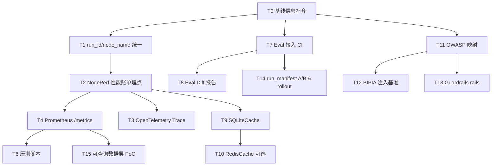

# 面向 Codex 的 Agent 架构优化 vibecoding 提示词包

## 执行摘要

本提示词包基于你当前“policy-driven research harness”架构（FastAPI 入口、ResearchExecutionSession 生命周期控制、LangGraph 状态机主链路与回退、Policy 控制平面、JSONL 持久化与 Eval harness、结构化 Contracts、renderer-first 报告与 Review 质量门禁），将路线图拆解为可被 Codex/自动化 agent 直接执行的任务与模板。  
核心交付是：一套**可执行任务清单**（含输入输出、验证、回滚、角色与估时）+ 五类**vibecoding 提示模板**（信息补齐、性能账单埋点、Eval 接入 CI、缓存层引入、安全护栏基线）。  
提示包优先对齐官方资料与原始基准/规范：FastAPI SSE citeturn0search2、LangGraph 持久化/缓存 citeturn0search0turn0search5、OpenTelemetry 语义规范 citeturn1search0、Prometheus/Alertmanager citeturn1search1turn1search2、GitHub Actions 工作流语法 citeturn1search3、OWASP LLM Top10 citeturn0search3turn0search7、微软间接注入防御与 BIPIA 基准 citeturn2search1turn2search2turn2search6。  
最后附两周内可交付的最小可行子集（3 个高优先级任务的完整可复制提示词），用于快速验证“可观测+质量门禁”的工程闭环。

## 目标与前提

### 执行目标与优先级

| 优先级 | 目标 | 可量化成功标准（建议默认） |
|---|---|---|
| P0 | 建立“可观测+可回归”的工程底座（节点级性能账单、统一 trace/metrics、质量回归可自动化） | 每次 run 产出 NodePerf/Token/Tool 统计；CI 中 eval 回归可阻断退化；能定位 p95 延迟来源 |
| P1 | 通过缓存与并行降低成本/延迟 | tokens/run 下降 ≥ {{TARGET_TOKEN_REDUCTION_PCT}}；p95 总时长下降 ≥ {{TARGET_P95_LAT_REDUCTION_PCT}} |
| P2 | 安全护栏基线（prompt injection、审计、输出过滤/脱敏） | 通过 OWASP 映射检查清单；注入测试集通过率 ≥ {{INJECTION_PASS_RATE}} citeturn0search3turn2search6 |
| P3 | 向“成熟平台化”演进（策略化、可查询数据层、实验控制、反馈闭环） | policy 可配置覆盖率提升；run 对比查询可用；A/B 与回滚机制可用 |

### 前提假设与“未指定”变量清单

以下变量在提示中一律保留为 `{{VAR}}` 形式；未提供则标注“未指定”，并给出获取方式（由模板 1 自动采集）。

| 维度 | 当前状态 | 变量占位符 | 获取方式（建议自动化） |
|---|---|---|---|
| 目标用途（更细的业务域） | 已知：垂类 research harness；业务域细分未指定 | {{DOMAIN}}, {{PRIMARY_OUTPUT_TYPE}} | 访谈/产品文档/真实 case 样本 |
| 部署环境（云/本地/混合） | 未指定 | {{DEPLOYMENT_ENV}}, {{K8S_OR_NOT}}, {{GPU_TYPE}} | `kubectl get nodes` / 机器清单 / IaC |
| 编程语言与框架 | 已知：Python、FastAPI、LangGraph | {{PY_VERSION}}, {{FASTAPI_VERSION}}, {{LANGGRAPH_VERSION}} | `python -V` / `pip show` |
| 模型类型与供应商 | 未指定 | {{LLM_PROVIDER}}, {{MAIN_MODEL}}, {{REVIEW_MODEL}}, {{EMBED_MODEL}} | 配置文件/环境变量/调用封装代码 |
| 数据源与存储 | 已知：JSONL 落盘；检索源未指定 | {{SEARCH_PROVIDERS}}, {{PERSIST_DIR}} | 代码检索/配置项/运行时日志 |
| 接口与通信协议 | 已知：FastAPI；stream 方式需确认 | {{STREAM_PROTOCOL}}(SSE/WS) | API 实现检查；建议 SSE citeturn0search2 |
| 安全与权限策略 | 未指定 | {{AUTHN}}, {{AUTHZ_MODEL}}, {{AUDIT_SCOPE}} | 安全评审/网关配置/鉴权中间件 |
| 监控与日志 | 未指定（目前有 run trace 概念） | {{OTEL_EXPORTER}}, {{PROM_ENDPOINT}} | OTel/Prometheus 集成任务输出 citeturn1search0turn1search1 |
| 成本预算 | 未指定 | {{MONTHLY_BUDGET}}, {{COST_PER_RUN_CAP}} | 财务/账单/运营目标 |
| 团队规模与技能 | 未指定 | {{TEAM_SIZE}}, {{ROLES}} | 组织信息/Owner 指定 |

### 优先来源清单（写入提示的“参考依据”）

为保证自动化 agent 执行时的“依据一致性”，提示模板内优先引用：

- FastAPI SSE（流式输出标准）citeturn0search2  
- LangGraph 持久化 checkpoint（容错/重放）citeturn0search0turn0search4  
- LangGraph Cache（SQLite/TTL 等）citeturn0search5  
- OpenTelemetry 语义规范（span/metric 统一命名）citeturn1search0  
- Prometheus Python client 与 Histogram 指导（量化 p95/p99）citeturn1search1turn1search5  
- Alertmanager 分组/去重/抑制（告警治理）citeturn1search2  
- GitHub Actions 工作流语法（CI 规范）citeturn1search3  
- OWASP LLM Top 10（LLM 应用风险基线，特别是 Prompt Injection）citeturn0search3turn0search7  
- Microsoft 间接注入防御（defense-in-depth）与 BIPIA 基准（可复现实验）citeturn2search1turn2search2turn2search6  
- NeMo Guardrails（input/output/retrieval/execution rails 概念与配置）citeturn2search3turn2search7  
- Codex/自动化执行与速率限制（使用与限流处理指引）citeturn3search0turn3search2turn3search10turn3search8  

## 任务清单

说明：每行是一个“可独立交付”的任务单元，适合 Codex 逐项执行并产出 PR/变更集。你可以直接把表格作为 backlog 导入（每行一张工单）。

> 表格中 `输入/输出/路径` 均使用占位符；自动化 agent 先通过模板 1 补齐变量，再执行其余任务。

| ID | 任务名 | 目的 | 前置条件 | 输入（文件/API/配置） | 输出（交付物） | 步骤（命令/伪代码） | 验证用例与成功判定 | 回滚步骤 | 估时 & 角色 |
|---|---|---|---|---|---|---|---|---|---|
| T0 | 基线信息补齐（自动采集+写入配置） | 将“未指定”变成可执行变量，避免后续任务卡死 | 可读 repo；可跑命令 | `{{REPO_ROOT}}`；运行环境访问；现有配置文件（未指定） | `prompt_pack/vars/baseline.json`；`ARCH_BASELINE.md` | 1) 扫描配置与 env；2) 读取依赖版本；3) 生成 baseline.json | 成功：baseline.json 覆盖率 ≥ 80%；关键变量（模型/部署/预算）明确或保持占位并列出缺口 | 删除新增文件；撤销配置变更 | 0.5–1d；角色：未指定（建议 Tech Lead + DevOps） |
| T1 | 统一 run_id / node_name 命名约定 | 为 trace/metrics/eval 对齐维度 | T0 完成 | `api/core/executor.py`、`contracts.py`（路径以实际为准） | `contracts` 新增字段或约定文档；兼容旧字段 | 伪代码：`run_id = uuid`；`node_name` 固定枚举；写入 state/trace | 用例：执行 1 次 /run 与 /stream；日志中所有 span/metric 均带 run_id 与 node_name | 回滚 commit；恢复旧字段 | 0.5–1d；角色：后端 未指定 |
| T2 | 节点级性能账单（NodePerf）埋点 | 让每次 run 产出“性能账单”（耗时、token、工具调用、回退） | T1 完成 | LangGraph 节点封装处；LLM 调用封装；tool 调用封装 | `contracts.NodePerf`；`trace/perf_bill.json`；`runs.jsonl` 新字段 | 1) 为每个 node 加 wrapper；2) 统计 tok_in/tok_out；3) 写入 trace | 成功：每次 run 输出包含 per-node t_ms、llm_calls、tok_in/out、fallback 标记；p95 可计算 | 恢复 wrapper；关闭 feature flag | 1–2d；角色：后端/平台 未指定 |
| T3 | OpenTelemetry Trace 基线接入 | 形成可跨服务关联的 trace（run_id 贯穿） | T2 完成 | OTel SDK 配置；exporter（未指定） | `otel` 初始化模块；span 覆盖 API->Session->node | 1) 初始化 tracer；2) API 中间件创建 root span；3) node wrapper 创建 child span；遵循语义约定 citeturn1search0 | 成功：可在 collector/UI 看到一次 run 的完整 trace；span 名称与属性一致 | 关闭 OTEL 开关；移除 exporter 配置 | 1–2d；角色：平台/SRE 未指定 |
| T4 | Prometheus 指标与 /metrics | 将 latency、tokens、fallback、errors 可量化并告警 | T2 完成 | `prometheus_client`；FastAPI 路由 | `/metrics`；指标：Histogram/Counter citeturn1search1turn1search5 | 1) 埋点 Histogram：node_latency_ms；2) Counter：tokens、fallback、errors；3) 暴露 /metrics | `curl /metrics` 有指标；压测下指标递增；可计算 p95 | 移除 /metrics 路由与埋点 | 0.5–1d；角色：后端/SRE 未指定 |
| T5 | 流式输出协议标准化为 SSE（如适用） | 降低客户端复杂度、提升稳定性 | T0 完成 | `/api/research/stream` 实现；header/callback | SSE 实现；文档更新 | 按 FastAPI SSE 指导实现 `text/event-stream` citeturn0search2 | 浏览器 EventSource/CLI 可稳定接收；断流率下降 | 恢复旧 stream 实现 | 0.5–1d；角色：后端 未指定 |
| T6 | Load/Soak 压测脚本 | 量化 TTFT/p95/错误率，建立基线 | T4 完成 | 压测工具（k6/locust/hey 未指定）；目标 URL | `bench/` 脚本；`bench/results/*.json` | 1) 并发阶梯 1→5→20→50；2) soak 1–2h；3) 输出报表 | 成功：产出基线报表；定位 top3 节点瓶颈 | 删除 bench；不影响主代码 | 1–2d；角色：SRE/后端 未指定 |
| T7 | Eval 接入 CI（GitHub Actions） | 把 eval 变成 release gate，阻断质量退化 | T0 完成 | `.github/workflows/*`；`api/evals/harness.py` | `ci-eval` workflow；artifact：eval 报告 | 按 GitHub Actions 语法编写工作流 citeturn1search3：安装依赖→跑 eval→上传报告→阈值 gate | PR 自动跑；低于阈值 fail；报告可下载 | 删除 workflow；恢复分支保护规则 | 1–2d；角色：后端/平台 未指定 |
| T8 | Eval Diff 报告（对比主分支） | 让“退化原因”可读可定位 | T7 完成 | baseline eval artifact；本次 eval artifact | `eval_diff.md`；`eval_diff.json` | 1) 拉取 main 分支结果；2) 比对 scorecard；3) 输出 top regressions | 成功：报告列出退化节点与样例 case；可追溯 run_manifest | 关闭 diff；只保留 gate | 1–2d；角色：后端 未指定 |
| T9 | 引入 SQLiteCache（低侵入缓存） | 优先降低重复检索/摘要成本 | T2 完成 | LangGraph cache（SQLiteCache）citeturn0search5；缓存 key 设计 | `cache.sqlite`；缓存命中率指标 | 1) 为 Search/摘要节点加 cache；2) TTL；3) 缓存命中埋点 | 成功：回归集 tokens/run 下降；不影响正确性（eval 通过） | 关闭 cache flag；删除 sqlite 文件 | 1–2d；角色：后端 未指定 |
| T10 | 引入 Redis 缓存层（可选） | 多实例共享缓存、提升命中 | T9 完成；Redis 可用（未指定） | Redis 地址/密码（未指定） | RedisCache 适配；部署文档 | 1) 接入 redis 客户端；2) namespace；3) 失败降级到无缓存 | 成功：多实例命中率提升；错误不影响主链路 | 切回 SQLite/无缓存 | 2–4d；角色：平台/SRE 未指定 |
| T11 | OWASP LLM Top10 映射清单（基线） | 把安全风险“清单化+可追踪” | T0 完成 | OWASP LLM Top10 citeturn0search3turn0search7；当前工具/节点清单 | `security/owasp_mapping.md`；风险 owner 表 | 1) 列出系统资产与数据流；2) 映射 Top10；3) 定义控制项与验收 | 成功：每个 Top10 条目有控制项/owner/计划；注入风险单独列出 | 无需回滚（文档） | 1–2d；角色：安全/后端 未指定 |
| T12 | 注入基准测试（BIPIA 子集）接入 | 将“间接注入”作为可回归测试 | T11 完成 | BIPIA repo/脚本 citeturn2search2turn2search6；测试策略（子集） | `security/bipia_runner.py`；CI job；报告 | 1) 选取 1–2 个任务子集；2) 建 runner；3) 输出通过率；4) gate（可选） | 成功：固定子集结果可复现；通过率达到阈值 | 关闭 gate；保留报告 | 2–4d；角色：安全/ML/后端 未指定 |
| T13 | Guardrails 基线（输入/输出/检索/执行 rails） | 提供最小护栏：拒绝高危输出/隔离外部指令 | T11 完成 | NeMo Guardrails rails 概念与配置 citeturn2search3turn2search7 | `guardrails/` 配置；拦截事件日志 | 1) 输入 rail：注入模式识别；2) 输出 rail：脱敏/拒绝；3) 执行 rail：工具白名单 | 成功：注入样例被拦截；正常样例不误杀（误杀率≤阈值） | 关闭 guardrails；恢复旧链路 | 3–6d；角色：安全/后端 未指定 |
| T14 | run_manifest 实验控制增强（A/B、rollout、回滚） | 从“记录”变“控制器”，支持灰度与回滚 | T7 完成 | run_manifest 定义；配置系统 | `contracts.Experiment`；查询脚本 | 1) 增加 experiment_id/variant/rollout；2) 记录到 trace；3) 支持按 variant 聚合 | 成功：可按 variant 查询质量/成本；可一键回滚到稳定组合 | 恢复旧 manifest schema | 2–4d；角色：平台/后端 未指定 |
| T15 | JSONL→可查询数据层（设计+双写 PoC） | 让 run 对比/聚合/多用户隔离可用 | T4 完成；DB 可用（未指定） | PostgreSQL/ClickHouse（未指定）；schema | `migrations/`；`storage/` 适配器；双写开关 | 1) 设计 schema（run/node_perf/eval）；2) 双写；3) 回填脚本 | 成功：能按 policy_version 查询趋势；性能可接受；不丢数据 | 关闭双写；仅写 JSONL | 1–3 周；角色：平台/数据 未指定 |

## 提示模板库

### 模板清单

| 模板 ID | 模板名称 | 覆盖任务 | 适用场景 |
|---|---|---|---|
| P-TPL-01 | 基线信息补齐模板 | T0 | 任何后续自动化执行前的“变量收集与落盘” |
| P-TPL-02 | 节点级性能账单埋点模板 | T1–T4 | LangGraph 节点 wrapper、token 统计、trace/metrics 贯穿 |
| P-TPL-03 | Eval 接入 CI 自动化模板 | T7–T8 | GitHub Actions 中跑 harness、产出报告与 gate citeturn1search3 |
| P-TPL-04 | 缓存层引入与回归模板 | T9–T10 | LangGraph cache（SQLite/TTL）与回归评测 citeturn0search5 |
| P-TPL-05 | 安全护栏基线自动化模板 | T11–T13 | OWASP 映射 + 注入基准（BIPIA）+ rails 集成 citeturn0search3turn2search6turn2search3 |

下面给出每个模板的**可直接复制粘贴给 Codex/自动化 agent**的 vibecoding 提示（中文），并包含 JSON Schema、示例输入/输出与示例日志。

### P-TPL-01 基线信息补齐任务模板

**上下文摘要**  
你正在一个“policy-driven research harness”代码库中自动化执行架构优化任务。后续任务需要部署/模型/预算/团队等信息，否则会卡死或产生错误假设。本模板目标是：**自动扫描 repo 与运行环境，生成 baseline.json 与缺口清单**，并保证所有未指定项以 `{{VAR}}` 占位符保留。

**输入 JSON Schema（baseline_info_request.schema.json）**  
```json
{
  "type": "object",
  "required": ["repo_root", "output_dir", "questions"],
  "properties": {
    "repo_root": { "type": "string", "description": "代码库根目录，例：/workspace/repo" },
    "output_dir": { "type": "string", "description": "输出目录，例：prompt_pack/vars" },
    "questions": {
      "type": "array",
      "items": { "type": "string" },
      "description": "需要补齐的维度问题列表"
    },
    "scan": {
      "type": "object",
      "properties": {
        "config_files_glob": { "type": "array", "items": { "type": "string" } },
        "env_var_allowlist": { "type": "array", "items": { "type": "string" } }
      }
    }
  }
}
```

**输出 JSON Schema（baseline_info_result.schema.json）**  
```json
{
  "type": "object",
  "required": ["baseline_path", "missing_items", "detected_versions"],
  "properties": {
    "baseline_path": { "type": "string" },
    "missing_items": {
      "type": "array",
      "items": {
        "type": "object",
        "required": ["key", "status", "how_to_get"],
        "properties": {
          "key": { "type": "string" },
          "status": { "type": "string", "enum": ["未指定", "已检测", "需人工确认"] },
          "how_to_get": { "type": "string" }
        }
      }
    },
    "detected_versions": { "type": "object" },
    "notes_md_path": { "type": "string" }
  }
}
```

**执行步骤（Codex 需严格按序执行）**  
1) 进入 `repo_root`，列出关键文件：`requirements.txt/pyproject.toml`、`api/`、`configs/`、`.env.example`、CI 配置等。  
2) 扫描配置文件与 env：只读取 allowlist 中的变量，禁止打印密钥值（仅输出是否存在、长度、是否空）。  
3) 自动检测版本：`python -V`、`pip show fastapi`、`pip show langgraph`（或从 lockfile 解析）。  
4) 写入 `output_dir/baseline.json`：所有未找到项写 `未指定` 并保留占位符，如 `{{DEPLOYMENT_ENV}}`。  
5) 生成 `output_dir/ARCH_BASELINE.md`：以表格列出已知/未知项、风险、下一步需要谁提供。  
6) 输出 `baseline_info_result.json`（符合 schema）。

**错误处理策略**  
- 若 repo 结构与预期不符：自动做一次 `ripgrep` 搜索关键词（`FastAPI`、`LangGraph`、`policy`、`defaults.json`、`runs.jsonl`），再重建文件路径映射。  
- 若缺少依赖命令：只读取 lockfile，不强制 pip install。  
- 若权限不足：把不足项写入 `missing_items`，并给出最小权限需求（只读/可执行/可写）。

**日志/可观测埋点要求**  
- 输出结构化日志 JSONL：`logs/baseline_scan.jsonl`，字段至少包含：`ts, step, status, repo_path, artifact_path`。  
- 所有日志必须避免泄露：API Key、密码、token、内部 URL（可用 `***` 替换）。

**示例调用（给 Codex 的输入 JSON）**  
```json
{
  "repo_root": "{{REPO_ROOT}}",
  "output_dir": "prompt_pack/vars",
  "questions": [
    "部署环境（云/本地/混合）",
    "主模型/审查模型/embedding 模型与供应商",
    "search 数据源与配额",
    "月度预算与单次 run 成本上限",
    "团队规模与 Owner"
  ],
  "scan": {
    "config_files_glob": ["**/*.json", "**/*.yaml", "**/*.yml", "**/*.toml", "**/*.env*", "**/*.py"],
    "env_var_allowlist": ["OPENAI_API_KEY", "LLM_PROVIDER", "MAIN_MODEL", "REVIEW_MODEL", "REDIS_URL"]
  }
}
```

**期望输出（示例）**  
```json
{
  "baseline_path": "prompt_pack/vars/baseline.json",
  "missing_items": [
    { "key": "DEPLOYMENT_ENV", "status": "未指定", "how_to_get": "向 DevOps 获取部署拓扑或查看 IaC/k8s 集群信息" },
    { "key": "MONTHLY_BUDGET", "status": "未指定", "how_to_get": "向产品/财务确认月预算与单次 run 成本上限" }
  ],
  "detected_versions": {
    "python": "3.11.x",
    "fastapi": "x.y.z",
    "langgraph": "x.y.z"
  },
  "notes_md_path": "prompt_pack/vars/ARCH_BASELINE.md"
}
```

**示例执行日志片段（JSONL）**  
```json
{"ts":"2026-04-05T10:12:01Z","step":"scan_repo","status":"ok","repo_path":"{{REPO_ROOT}}"}
{"ts":"2026-04-05T10:12:07Z","step":"detect_versions","status":"ok","artifact_path":"prompt_pack/vars/baseline.json"}
{"ts":"2026-04-05T10:12:10Z","step":"write_notes","status":"ok","artifact_path":"prompt_pack/vars/ARCH_BASELINE.md"}
```

**优先来源（写入提示末尾，供 agent 查阅）**  
（作为背景依据：后续 SSE/缓存/追踪/CI/安全任务会用到）  
- FastAPI SSE：text/event-stream 标准流式 citeturn0search2  
- LangGraph 持久化/缓存 citeturn0search0turn0search5  

### P-TPL-02 节点级性能账单埋点实现模板

**上下文摘要**  
目标：为 LangGraph 状态机每个 node 注入计时与计数逻辑，产出 NodePerf（per-node t_ms、LLM 调用次数、token in/out、tool 调用次数、fallback 标记），并把 run_id 贯穿至 trace/metrics。OpenTelemetry 语义规范建议统一命名与属性，从而便于跨系统关联。citeturn1search0

**输入 JSON Schema（node_perf_request.schema.json）**  
```json
{
  "type": "object",
  "required": ["repo_root", "graph_file", "contracts_file", "executor_file", "output_contracts"],
  "properties": {
    "repo_root": { "type": "string" },
    "graph_file": { "type": "string" },
    "contracts_file": { "type": "string" },
    "executor_file": { "type": "string" },
    "llm_wrapper_files": { "type": "array", "items": { "type": "string" } },
    "tool_wrapper_files": { "type": "array", "items": { "type": "string" } },
    "output_contracts": {
      "type": "object",
      "properties": {
        "node_perf_class_name": { "type": "string" },
        "trace_output_path": { "type": "string" }
      }
    },
    "feature_flag": { "type": "string" }
  }
}
```

**输出 JSON Schema（node_perf_result.schema.json）**  
```json
{
  "type": "object",
  "required": ["changed_files", "new_artifacts", "how_to_verify"],
  "properties": {
    "changed_files": { "type": "array", "items": { "type": "string" } },
    "new_artifacts": { "type": "array", "items": { "type": "string" } },
    "how_to_verify": { "type": "array", "items": { "type": "string" } },
    "rollback_plan": { "type": "array", "items": { "type": "string" } }
  }
}
```

**执行步骤（建议实现策略）**  
1) 在 `contracts_file` 新增：  
- `NodePerf`：字段 `node, t_ms, llm_calls, tok_in, tok_out, tool_calls, fallback, error_type(optional)`  
- `PerfBill`：`run_id + list[NodePerf] + totals`  
2) 在 `executor_file`：生成 `run_id`；初始化 counters；把 `run_id` 写入 state/context。  
3) 在 `graph_file`：为每个 node 函数添加统一 wrapper，例如 `instrument(node_name, fn)`。  
4) token 统计：  
- 优先从你现有 LLM client wrapper 得到 usage（若供应商支持）；否则从 prompt/response 文本估算（并明确标记 `estimated=true`）。  
5) 写 trace：每次 node 完成时 append 一条 NodePerf；最终输出 `trace_output_path`（例如 `runs/{{run_id}}/perf_bill.json`）并落入 JSONL persistence。  
6) 若启用 OTel：在 wrapper 内创建 span（child of run root span），属性带 `run_id,node_name,fallback`，命名遵循语义约定。citeturn1search0  

**错误处理策略**  
- 如果某些 node 不是纯函数（有副作用）：wrapper 仍然只负责记录，不改变语义；失败时记录 `error_type`，并沿原逻辑抛出/回退。  
- 如果 token usage 不可得：输出中必须显式标记估算，避免误导成本统计。  
- 必须通过 feature flag 控制启用（默认开/关由 `{{ENABLE_NODE_PERF}}` 决定）。

**日志/可观测埋点要求**  
- Prometheus：Histogram（node_latency_ms）与 tokens counters，按 Prometheus Python client 指导实现。citeturn1search1turn1search5  
- OTel：span attribute 统一键名（例如 `app.run_id`、`app.node`），保持稳定。

**示例输入 JSON**  
```json
{
  "repo_root": "{{REPO_ROOT}}",
  "graph_file": "api/core/graph.py",
  "contracts_file": "api/core/contracts.py",
  "executor_file": "api/core/executor.py",
  "llm_wrapper_files": ["api/core/llm_client.py"],
  "tool_wrapper_files": ["api/tools/*.py"],
  "output_contracts": {
    "node_perf_class_name": "NodePerf",
    "trace_output_path": "runs/{{run_id}}/perf_bill.json"
  },
  "feature_flag": "ENABLE_NODE_PERF"
}
```

**期望输出（示例）**  
```json
{
  "changed_files": [
    "api/core/contracts.py",
    "api/core/executor.py",
    "api/core/graph.py"
  ],
  "new_artifacts": [
    "runs/{{run_id}}/perf_bill.json"
  ],
  "how_to_verify": [
    "运行: curl -X POST {{BASE_URL}}/api/research/run -d @sample_request.json",
    "检查: runs/{{run_id}}/perf_bill.json 存在且包含 Query/Insight/Report 等节点",
    "检查: /metrics 中 node_latency_ms 与 tokens 计数递增"
  ],
  "rollback_plan": [
    "设置 ENABLE_NODE_PERF=0",
    "回滚本次提交"
  ]
}
```

**示例执行日志片段**  
```json
{"ts":"2026-04-05T10:30:01Z","step":"wrap_node","node":"Search","status":"ok","t_ms":842}
{"ts":"2026-04-05T10:30:03Z","step":"wrap_node","node":"Insight","status":"ok","tok_in":8120,"tok_out":920}
{"ts":"2026-04-05T10:30:04Z","step":"write_perf_bill","status":"ok","path":"runs/7f.../perf_bill.json"}
```

### P-TPL-03 将 eval 接入 CI 的自动化模板

**上下文摘要**  
目标：把已有 eval harness（case replay / scorecard）接入 GitHub Actions，形成 PR 级别的质量门禁，并生成报告 artifact。GitHub Actions 需要遵循官方 workflow YAML 语法。citeturn1search3

**输入 JSON Schema（ci_eval_request.schema.json）**  
```json
{
  "type": "object",
  "required": ["repo_root", "workflow_path", "eval_command", "thresholds"],
  "properties": {
    "repo_root": { "type": "string" },
    "workflow_path": { "type": "string" },
    "python_version": { "type": "string" },
    "eval_command": { "type": "string" },
    "thresholds": {
      "type": "object",
      "properties": {
        "min_overall_score": { "type": "number" },
        "max_regression_pct": { "type": "number" }
      }
    },
    "artifacts": { "type": "array", "items": { "type": "string" } }
  }
}
```

**输出 JSON Schema（ci_eval_result.schema.json）**  
```json
{
  "type": "object",
  "required": ["workflow_file", "artifacts", "gating_logic"],
  "properties": {
    "workflow_file": { "type": "string" },
    "artifacts": { "type": "array", "items": { "type": "string" } },
    "gating_logic": { "type": "string" },
    "rollback_plan": { "type": "array", "items": { "type": "string" } }
  }
}
```

**执行步骤（建议）**  
1) 新建 `.github/workflows/ci-eval.yml`：触发条件 `pull_request`、`push`（可选），“只在相关路径变更时触发”（例如修改 prompt/policy/agents 时）。GitHub Actions 支持在 YAML 内定义 jobs/steps。citeturn1search3  
2) Steps：  
- checkout  
- setup python（{{PY_VERSION}}）  
- 安装依赖（pip/poetry）  
- 运行 `eval_command`（例如 `python -m api.evals.harness --cases ... --out eval_results.json`）  
- 解析输出：若总体分数 < `min_overall_score` 则失败  
- 上传 artifact（`eval_results.json`, `eval_report.md`）  
3) 输出：把阈值写入 `ci/eval_thresholds.json`（或直接写 workflow env）。

**错误处理策略**  
- harness 不稳定：将 gate 先降级为“只生成报告不 fail”，并在两周内把噪声压下去后再开启强 gate。  
- 缺少 secrets：把对外部模型调用的 key 使用 GitHub Secrets；不允许在日志中打印。  
- 时间超限：对 eval case 子集做 smoke（例如 20 个）；夜间再跑 full。

**日志/可观测要求**  
- 在 CI 中打印“总体分数、各节点分数、退化 TopN case id”；但不得打印用户敏感内容。  
- artifact 必须包含 run_manifest（prompt/policy/code/model version）以便追溯。

**示例输入 JSON**  
```json
{
  "repo_root": "{{REPO_ROOT}}",
  "workflow_path": ".github/workflows/ci-eval.yml",
  "python_version": "3.11",
  "eval_command": "python -m api.evals.harness --suite smoke --out eval_results.json --report eval_report.md",
  "thresholds": {
    "min_overall_score": 0.75,
    "max_regression_pct": 5.0
  },
  "artifacts": ["eval_results.json", "eval_report.md"]
}
```

**期望输出（示例）**  
```json
{
  "workflow_file": ".github/workflows/ci-eval.yml",
  "artifacts": ["eval_results.json", "eval_report.md"],
  "gating_logic": "if overall_score < 0.75 then fail; if regression_pct > 5% then fail",
  "rollback_plan": [
    "将 workflow 中的 gate 步骤改为 continue-on-error",
    "或回滚 workflow 文件"
  ]
}
```

**示例执行日志片段（CI）**  
```text
[ci-eval] Running smoke eval suite...
[ci-eval] overall_score=0.78 (threshold=0.75) PASS
[ci-eval] node_scores: Search=0.81 Query=0.74 Insight=0.77 Report=0.80 Review=0.79
[ci-eval] Uploading artifacts: eval_results.json, eval_report.md
```

### P-TPL-04 引入缓存层（Redis/SQLite）并回归测试的自动化模板

**上下文摘要**  
优先用低侵入的 SQLiteCache 实现 node 级缓存，覆盖 Search 结果与摘要/裁剪输出，减少重复 token 消耗。LangGraph cache 参考实现提供 SQLite 缓存、TTL 与 namespace 的基本能力，可用于“快速收益”的性能优化。citeturn0search5

**输入 JSON Schema（cache_request.schema.json）**  
```json
{
  "type": "object",
  "required": ["repo_root", "cache_backend", "cache_targets", "ttl_seconds", "eval_command"],
  "properties": {
    "repo_root": { "type": "string" },
    "cache_backend": { "type": "string", "enum": ["sqlite", "redis"] },
    "sqlite_path": { "type": "string" },
    "redis_url": { "type": "string" },
    "cache_targets": {
      "type": "array",
      "items": { "type": "string", "enum": ["search", "summarize", "report_sections"] }
    },
    "ttl_seconds": { "type": "integer" },
    "feature_flag": { "type": "string" },
    "eval_command": { "type": "string" }
  }
}
```

**输出 JSON Schema（cache_result.schema.json）**  
```json
{
  "type": "object",
  "required": ["changed_files", "bench_delta", "eval_passed"],
  "properties": {
    "changed_files": { "type": "array", "items": { "type": "string" } },
    "bench_delta": {
      "type": "object",
      "properties": {
        "tokens_per_run_pct": { "type": "number" },
        "p95_latency_pct": { "type": "number" },
        "cache_hit_rate": { "type": "number" }
      }
    },
    "eval_passed": { "type": "boolean" },
    "rollback_plan": { "type": "array", "items": { "type": "string" } }
  }
}
```

**执行步骤**  
1) 设计 cache key：  
- `search`：`hash(query_pack + source_tier + time_window + lang)`  
- `summarize`：`hash(evidence_item_id + summarizer_version)`  
2) 接入 SQLiteCache：初始化时指定文件路径（`{{CACHE_SQLITE_PATH}}`），对目标节点应用 cache get/set（TTL={{TTL}}）。citeturn0search5  
3) 缓存降级：缓存异常不得影响主链路（try/except，记录 error counter）。  
4) 回归：运行 `eval_command`；并运行一次短压测/重复请求测试（确保命中率）。  
5) 输出 bench_delta：从 NodePerf/metrics 计算 tokens/run 与 p95 的变化（若无完整压测，用 smoke 近似并标注）。

**错误处理策略**  
- 命中率低：先扩大复用粒度（例如只缓存检索 raw 结果），再缓存摘要。  
- 数据过时：缩短 TTL 或把“时间窗口”纳入 key。  
- 误缓存：对带用户敏感信息的内容禁缓存（或加 per-tenant namespace）。

**埋点要求**  
- 指标：`cache_hits_total{target=...}`、`cache_misses_total`、`cache_errors_total`。  
- 在 perf_bill 中记录 `cache_hit=true/false`（可选）。

**示例输入（SQLite）**  
```json
{
  "repo_root": "{{REPO_ROOT}}",
  "cache_backend": "sqlite",
  "sqlite_path": "var/cache/langgraph_cache.sqlite",
  "cache_targets": ["search", "summarize"],
  "ttl_seconds": 1800,
  "feature_flag": "ENABLE_CACHE",
  "eval_command": "python -m api.evals.harness --suite smoke --out eval_results.json"
}
```

**期望输出（示例）**  
```json
{
  "changed_files": ["api/agents/search_agent.py", "api/core/cache.py"],
  "bench_delta": { "tokens_per_run_pct": -18.5, "p95_latency_pct": -12.0, "cache_hit_rate": 0.42 },
  "eval_passed": true,
  "rollback_plan": ["ENABLE_CACHE=0", "删除 sqlite 文件", "回滚提交"]
}
```

**示例执行日志片段**  
```text
[cache] backend=sqlite path=var/cache/langgraph_cache.sqlite ttl=1800s
[cache] target=search hit=1 miss=2 error=0
[eval] smoke suite PASS overall_score=0.79
```

### P-TPL-05 安全护栏基线（OWASP 映射 + 注入基准测试）自动化模板

**上下文摘要**  
你的系统会检索外部内容并进入 LLM 推理链路，天然暴露于 prompt injection（尤其是间接注入）风险。OWASP LLM Top 10 提供了 LLM 应用常见风险分类与缓解方向，其中 Prompt Injection 是首要风险类别之一。citeturn0search3turn0search7  
微软公开了对“间接 prompt injection”的 defense-in-depth 思路，并提供 BIPIA 作为评测鲁棒性的基准与复现指引，可用来把安全变成可回归测试。citeturn2search1turn2search2turn2search6  
Guardrails 方面，NeMo Guardrails 提供 input/output/retrieval/execution rails 的配置框架，可作为最小护栏实现参考。citeturn2search3turn2search7

**输入 JSON Schema（security_request.schema.json）**  
```json
{
  "type": "object",
  "required": ["repo_root", "outputs", "bipia", "guardrails_mode"],
  "properties": {
    "repo_root": { "type": "string" },
    "outputs": {
      "type": "object",
      "required": ["owasp_mapping_md", "injection_report_json", "guardrails_config_dir"],
      "properties": {
        "owasp_mapping_md": { "type": "string" },
        "injection_report_json": { "type": "string" },
        "guardrails_config_dir": { "type": "string" }
      }
    },
    "bipia": {
      "type": "object",
      "properties": {
        "enabled": { "type": "boolean" },
        "dataset_subset": { "type": "array", "items": { "type": "string" } },
        "pass_threshold": { "type": "number" }
      }
    },
    "guardrails_mode": { "type": "string", "enum": ["docs_only", "minimal_blocking", "full_rails"] },
    "feature_flag": { "type": "string" }
  }
}
```

**输出 JSON Schema（security_result.schema.json）**  
```json
{
  "type": "object",
  "required": ["artifacts", "risk_register", "tests_added"],
  "properties": {
    "artifacts": { "type": "array", "items": { "type": "string" } },
    "risk_register": { "type": "array", "items": { "type": "object" } },
    "tests_added": { "type": "array", "items": { "type": "string" } },
    "rollback_plan": { "type": "array", "items": { "type": "string" } }
  }
}
```

**执行步骤**  
1) 生成 `owasp_mapping_md`：  
- 左侧列 OWASP LLM Top10（至少覆盖：Prompt Injection、敏感信息泄露、供应链/不安全插件、过度权限工具调用等），右侧列：该系统的“资产/入口/控制项/Owner/里程碑”。citeturn0search3turn0search7  
2) 若 `bipia.enabled=true`：  
- 以子集方式接入 BIPIA（避免一次性引入过大依赖）；实现 runner：输入一组“带外部上下文的任务”，输出通过率与失败样例列表；把结果写入 `injection_report_json`。citeturn2search2turn2search6  
3) Guardrails：  
- `docs_only`：只生成配置骨架与集成点，不启用拦截。  
- `minimal_blocking`：实现最小输入/输出拦截：检测“外部内容中的指令性文本”并降权/隔离；检测输出中的敏感字段并拒绝/脱敏。  
- `full_rails`：加入 retrieval/execution rails：工具白名单、参数校验、拒绝数据外传模式。citeturn2search3turn2search7  
4) 将注入 runner（或最小注入样例集）加入 CI（可先 report-only，再 gate）。

**错误处理策略**  
- 若 BIPIA 受许可/数据限制：仅接入 repo 中可运行的子集，或用自建“最小注入样例集”替代，并在报告中标注原因。  
- 若 guardrails 误杀：默认只告警不拦截，先收集误杀样例再调规则。

**埋点与审计要求**  
- 每次触发拦截输出结构化审计事件：`run_id, rail_type, reason_code, action_taken(block/redact/warn)`。  
- 不记录原始敏感文本；仅记录 hash 与摘要。

**示例输入**  
```json
{
  "repo_root": "{{REPO_ROOT}}",
  "outputs": {
    "owasp_mapping_md": "security/owasp_mapping.md",
    "injection_report_json": "security/injection_report.json",
    "guardrails_config_dir": "guardrails/"
  },
  "bipia": {
    "enabled": true,
    "dataset_subset": ["qa"],
    "pass_threshold": 0.85
  },
  "guardrails_mode": "minimal_blocking",
  "feature_flag": "ENABLE_GUARDRAILS"
}
```

**期望输出（示例）**  
```json
{
  "artifacts": [
    "security/owasp_mapping.md",
    "security/injection_report.json",
    "guardrails/config.yml"
  ],
  "risk_register": [
    { "risk": "LLM01 Prompt Injection", "control": "外部内容指令隔离 + 输出脱敏 + 工具白名单", "owner": "未指定" }
  ],
  "tests_added": ["security/bipia_runner.py", ".github/workflows/security-injection.yml"],
  "rollback_plan": ["ENABLE_GUARDRAILS=0", "CI 中将 gate 改为 report-only", "回滚相关提交"]
}
```

**示例执行日志片段**  
```text
[security] OWASP mapping generated: security/owasp_mapping.md
[bipia] subset=qa pass_rate=0.88 threshold=0.85 PASS
[guardrails] mode=minimal_blocking enabled=1 blocked_outputs=2 redacted=1
```

## 优先级与依赖

### 任务依赖关系图（Mermaid）



### 优先级排序建议

P0（两周内推荐完成）：T0 → T2 → T7（并尽量补上 T4）  
P1（随后迭代）：T9（SQLiteCache）→ T6（压测完整化）→ T8（eval diff）  
P2（安全并行）：T11 → T12（report-only 起步）→ T13  
P3（平台化）：T14 → T15 →（更深的策略化/Planner-Generator 拆分，另立专题任务）

## 风险与缓解

| 任务 | 主要风险 | 影响 | 缓解措施 |
|---|---|---|---|
| T0 | 基线信息仍缺失（模型/部署/预算拿不到） | 后续任务无法落地或产生错误假设 | 强制输出“缺口清单+Owner”；把关键变量保持为 `{{VAR}}`，禁止 hardcode |
| T2 | token 统计不准（供应商 usage 不可得） | 成本测算误导 | 明确 `estimated=true/false`；优先改造 LLM wrapper 暴露 usage |
| T3 | OTel 集成影响性能或配置复杂 | 线上延迟上升、定位更难 | feature flag；分环境启用；先 exporter=console，再接 collector；遵循语义规范 citeturn1search0 |
| T4 | 指标维度爆炸（label cardinality 过高） | Prometheus 压力大、查询慢 | 禁止高基数字段做 label（例如 user_id）；保留 run_id 仅写日志/trace，不写 metrics label |
| T7 | eval 噪声导致“误阻断” | CI 频繁失败，团队抵触 | 两阶段：先 report-only；稳定后再 gate；区分 smoke 与 nightly |
| T9 | 缓存引入“错误复用/过期信息” | 正确性下降 | TTL + key 包含时间窗口；对敏感/个性化内容禁缓存；回归集保障 |
| T11–T13 | 安全护栏误杀/漏杀 | 可用性下降或风险未控 | 分级策略：warn→block；引入基准集（BIPIA 或最小集）做回归 citeturn2search6turn2search2 |
| 自动化执行（总风险） | Codex 权限过大导致误删/误改 | 破坏仓库/泄露秘密 | 最小权限；只在分支操作；禁止打印 secrets；强制测试通过才允许合并 |

## 使用说明与交付物

### 如何把提示词交给 Codex/自动化 agent

**推荐运行方式（两种）**  
- Codex 产品/界面：Codex 是 OpenAI 的 coding agent，可读取仓库、修改文件并运行命令；官方 quickstart 指出可在界面中启动任务、查看日志与 diff。citeturn3search0turn3search4  
- Codex CLI：官方文档提供 CLI 安装与在终端运行的方式（首次运行需登录，可用 ChatGPT 账号或 API key）。citeturn3search8  

**环境变量与权限要求（最小集合）**  
- Repo：对 `{{REPO_ROOT}}` 需要读写权限（建议在分支/工作副本）。  
- 可执行权限：允许运行 `python`、测试命令、lint 命令、压测命令。  
- Secrets：模型 API key、Redis 密码等必须通过安全注入（CI secrets/本地 keychain），禁止写入 repo。  
- 速率限制：若调用 OpenAI API，注意 RPM/TPM 等维度限制，并实现退避重试与并发控制。citeturn3search2turn3search10  

**速率限制与并发建议（写入所有模板的通用约束）**  
- 默认并发：`{{MAX_CONCURRENCY}}`（未指定，建议先 2–4）。  
- 429/RateLimit：指数退避 + 抖动；优先减少并发而不是盲目重试。citeturn3search10  
- 长任务：拆分为多个 PR；每个 PR 交付单一能力并可回滚。

**回滚触发条件（建议写入自动化 agent 的“硬规则”）**  
- 单元/集成测试未通过；或 CI eval 低于阈值（T7 gate）。  
- 关键指标恶化：p95 上升超过 `{{REGRESSION_PCT_CAP}}`。  
- 安全基准失败（注入通过率低于阈值），则禁用 guardrails gate 改为 report-only 并回滚拦截逻辑。

### 输出格式与交付物

本提示包建议以“目录化提示集”形式交付（你可以直接复制到仓库 `prompt_pack/` 下）：

```text
prompt_pack/
  README.md
  vars/
    baseline.json
    baseline_info_request.schema.json
    baseline_info_result.schema.json
  tasks/
    task_list.md
    task_T0_baseline.md
    task_T2_node_perf.md
    task_T7_ci_eval.md
    ...
  templates/
    P-TPL-01_baseline_info.md
    P-TPL-02_node_perf.md
    P-TPL-03_ci_eval.md
    P-TPL-04_cache_layer.md
    P-TPL-05_security_guardrails.md
  schemas/
    node_perf_request.schema.json
    node_perf_result.schema.json
    ci_eval_request.schema.json
    ci_eval_result.schema.json
    cache_request.schema.json
    cache_result.schema.json
    security_request.schema.json
    security_result.schema.json
  examples/
    01_baseline_info.input.json
    01_baseline_info.expected_output.json
    02_node_perf.input.json
    ...
  logs/
    (运行时由自动化 agent 生成 *.jsonl)
```

### README.md 模板（中文）

```markdown
# Agent 架构优化 vibecoding 提示包（Codex/自动化执行）

## 目标
- 为现有 policy-driven research harness 建立可观测与可回归底座（NodePerf、Trace/Metrics、CI Eval Gate）
- 在保证质量的前提下，通过缓存/并行降低成本与延迟
- 建立安全护栏基线：OWASP 映射 + 注入基准回归 + rails 拦截（可先 report-only）

## 适用代码库特征
- FastAPI API 层：/api/research/run /stream /cases /eval
- ResearchExecutionSession：负责 run_id、policy、run_manifest、trace、quality_summary
- LangGraph StateGraph：IntentRouter -> Search -> Query -> Insight -> QualityGate -> Report -> Review（含回退/熔断）
- Policy 控制平面：defaults.json + policy_loader + policies.py
- Persistence/Eval：runs.jsonl / traces / eval_results + case replay/scorecards
- Contracts：EvidenceItem/Claim/QualitySummary/RunTraceEntry/CaseEvaluation 等

## 使用方式
1. 先执行 templates/P-TPL-01_baseline_info.md 生成 vars/baseline.json
2. 再按 tasks/task_list.md 的顺序执行高优任务（建议：T2 NodePerf -> T7 CI Eval -> T4 /metrics）
3. 每个任务都应在独立分支完成并通过测试后提交 PR

## 环境变量（示例）
- REPO_ROOT=/workspace/repo
- ENABLE_NODE_PERF=1
- ENABLE_CACHE=0
- ENABLE_GUARDRAILS=0
- OPENAI_API_KEY=（仅以安全方式注入，不写入仓库）

## 回滚原则
- 任何任务引入的功能必须由 feature flag 控制
- 发生质量退化（CI eval gate fail）或测试失败：立即关闭 flag 并回滚提交

## 优先来源（执行时用于核对）
- FastAPI SSE（text/event-stream）：https://fastapi.tiangolo.com/tutorial/server-sent-events/
- LangGraph persistence：https://docs.langchain.com/oss/python/langgraph/persistence
- LangGraph cache reference：https://reference.langchain.org.cn/python/langgraph/cache/
- OpenTelemetry semantic conventions：https://opentelemetry.io/docs/specs/semconv/
- Prometheus python client：https://github.com/prometheus/client_python
- Alertmanager docs：https://prometheus.io/docs/alerting/latest/alertmanager/
- GitHub Actions workflow syntax：https://docs.github.com/en/actions/reference/workflows-and-actions/workflow-syntax
- OWASP LLM Top 10：https://owasp.org/www-project-top-10-for-large-language-model-applications/
- Microsoft BIPIA：https://github.com/microsoft/BIPIA
- NeMo Guardrails：https://github.com/NVIDIA-NeMo/Guardrails

## 产出物约定
- 所有运行日志写入 logs/*.jsonl（禁止泄露 secrets）
- 所有评测写入 eval_results.json + eval_report.md 并上传 artifact
- 所有性能账单写入 runs/{{run_id}}/perf_bill.json
```

## 两周内可执行的最小可行提示子集

以下 3 个提示是“立即可交付与验证”的最小子集（P0），建议按顺序交给 Codex 执行；每个提示都尽量做到：**独立可交付、可回滚、可验证**。

### MVP 提示一：T0 基线信息补齐（生成 baseline.json）

```text
你是 Codex（coding agent）。在 {{REPO_ROOT}} 仓库内执行“基线信息补齐”任务。

目标：
1) 自动扫描 repo 与运行环境，生成 prompt_pack/vars/baseline.json（所有未指定项用 {{VAR}} 占位符保留，并标注“未指定”）。
2) 生成 prompt_pack/vars/ARCH_BASELINE.md（表格列出：已知/未指定/风险/如何获取）。
3) 输出 logs/baseline_scan.jsonl（结构化日志，禁止泄露 secrets）。

硬约束：
- 不得打印任何密钥内容；只允许输出是否存在/是否为空/长度范围（例如 len>0）。
- 不得改动业务逻辑代码；只新增 prompt_pack/ 与 logs/ 下的文件。
- 若 repo 结构与预期不符：用 ripgrep 搜索关键词 fastapi/langgraph/defaults.json/runs.jsonl 重建路径映射。

执行步骤：
A. 在 repo 根目录运行：
   - 列出目录结构（深度 3）：ls / tree
   - 检测版本：python -V；pip show fastapi；pip show langgraph（失败则从 lockfile 解析）
B. 扫描配置文件（优先）：**/*.json **/*.yml **/*.yaml **/*.toml **/*.env* 以及 api/ 下 .py
C. 生成 baseline.json，至少包含：
   - DEPLOYMENT_ENV（未指定则 {{DEPLOYMENT_ENV}}）
   - LLM_PROVIDER / MAIN_MODEL / REVIEW_MODEL / EMBED_MODEL（未指定则占位）
   - STREAM_PROTOCOL（建议 SSE，但先检测实际实现）
   - PERSIST_DIR（runs.jsonl 存放路径）
   - MONTHLY_BUDGET / COST_PER_RUN_CAP（未指定）
   - TEAM_SIZE / ROLES / OWNER（未指定）
D. 生成 ARCH_BASELINE.md：按维度列出风险与“如何获取”。

验收：
- baseline.json 与 ARCH_BASELINE.md 均存在且内容完整；
- missing_items 中至少列出部署/模型/预算/团队 4 类缺口；
- 日志 logs/baseline_scan.jsonl 存在且无敏感信息泄露。

输出：
- 给我一个 JSON 摘要：{baseline_path, notes_md_path, missing_items_count, detected_versions}
```

### MVP 提示二：T2 节点级性能账单（NodePerf）埋点 + /metrics（最小集）

```text
你是 Codex。请在 {{REPO_ROOT}} 内实现“节点级性能账单 + Prometheus /metrics（最小集）”。

背景：
该项目是 LangGraph 状态机式研究流（Search/Query/Insight/QualityGate/Report/Review 等节点）。现在需要每次 run 产出 per-node 性能账单（t_ms、llm_calls、tok_in/out、tool_calls、fallback），并能通过 /metrics 采集 node_latency_ms 等指标。
参考依据：
- Prometheus Python client（Counter/Histogram）：https://github.com/prometheus/client_python
- Histogram 用于聚合 quantile：https://prometheus.github.io/client_python/instrumenting/histogram/
- OpenTelemetry 语义规范可选（先不强制接入）：https://opentelemetry.io/docs/specs/semconv/

要求：
1) 新增 contracts：NodePerf / PerfBill（或等价结构），并保证向后兼容。
2) 为每个 LangGraph 节点加统一 wrapper（instrument），记录 NodePerf；将 perf_bill 写入 runs/{{run_id}}/perf_bill.json。
3) 新增 /metrics endpoint（FastAPI 路由），并埋点：
   - Histogram: agent_node_latency_ms{node="Search|Query|..."}
   - Counter: agent_tokens_in_total{model="..."} / agent_tokens_out_total{model="..."}
   - Counter: agent_fallback_total{from_node="Review",to_node="Query|Insight|Report"}
4) 所有功能必须由 feature flag 控制（{{ENABLE_NODE_PERF}} 默认 0）。
5) 必须提供最小验证脚本（或文档步骤）：运行一次 /api/research/run 后检查 perf_bill 文件存在、/metrics 有数据。
6) 不能破坏既有回退/熔断逻辑；异常时记录 error_type 并让原流程继续。

实现提示：
- token 统计优先读取 LLM client 返回 usage；若拿不到则写 estimated=true 并用粗略估算（但必须明确标记）。
- wrapper 中不得改变 state 语义，只能追加诊断字段。

回滚：
- 关闭 ENABLE_NODE_PERF；
- 回滚提交；
- 删除 runs/ 下新文件不影响主流程。

输出：
- 列出改动文件清单、关键代码片段位置、验证命令与预期结果。
```

### MVP 提示三：T7 Eval 接入 CI（GitHub Actions gate + artifact）

```text
你是 Codex。请把现有 eval harness 接入 GitHub Actions，形成 PR 级别的质量门禁（先 smoke 子集）。

参考依据：
- GitHub Actions workflow YAML 语法：https://docs.github.com/en/actions/reference/workflows-and-actions/workflow-syntax
目标：
1) 新增 .github/workflows/ci-eval.yml，在 pull_request 触发。
2) 安装依赖并运行 smoke eval（命令从代码中识别；若不存在 smoke 参数，则你创建一个最小子集配置）。
3) 生成 eval_results.json 与 eval_report.md，并作为 artifact 上传。
4) Gate 规则：
   - overall_score < {{MIN_OVERALL_SCORE}}（默认 0.75）则 fail
   - 若无法稳定计算 regression，则先只做 overall gate
5) 日志输出：overall_score、各节点分数、Top 5 失败 case id（不得打印敏感内容）。

执行步骤：
A) 在 repo 中定位 eval harness 入口（如 api/evals/harness.py 或等价），确定如何传入 case 集与输出路径。
B) 生成 ci-eval.yml，包含：checkout、setup-python、install deps、run eval、上传 artifact、gate。
C) 给出本地复现命令（与 CI 一致）。

回滚：
- 删除 workflow 文件或将 gate 步骤设为 continue-on-error。

输出：
- workflow 文件内容
- 运行说明
- gate 的阈值配置位置
```

以上三项完成后，你会立即获得：  
- 可量化的 NodePerf 指标与 /metrics（为后续缓存/并行/推理优化提供度量基线）citeturn1search1turn1search5  
- 可自动化回归的 CI eval gate（把质量变成发布门禁）citeturn1search3  
- 一份补齐“未指定变量”的 baseline.json（让路线图从“建议”变“可执行工单”）