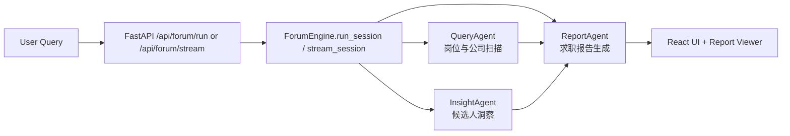

# System Map

## 请求主链路

## 后端职责分层

- `api/main.py`
  - HTTP 入口
  - 普通接口与 SSE 流式接口
- `ForumEngine/forum.py`
  - 主编排器
  - 顺序调用 3 个轻量 Agent
  - 负责会话记忆拼接和最终消息整理
- `utils/conversation_store.py`
  - best-effort 会话存储
  - PostgreSQL 不可用时允许主流程继续
- `ReportEngine`
  - 聚合多个 Agent 输出
  - 生成最终 Markdown 报告

## 前端职责分层

- `web/src/App.tsx`
  - 页面布局、输入区和双视图切换
- `web/src/hooks/useForumChat.ts`
  - 请求发送、SSE 事件消费、消息状态管理
- `web/src/lib/api.ts`
  - REST 与 SSE 协议处理
- `web/src/components/ReportViewer.tsx`
  - 报告阅读体验

## SSE 事件协议

流式接口 `GET /api/forum/stream` 返回这些事件：

- `meta`
  - 返回 `session_id`
- `status`
  - 字段：`agent`、`phase`、`detail`
- `message`
  - 返回某个 Agent 的正文内容
- `done`
  - 本次编排完成
- `error`
  - 返回错误类型与错误详情

## 面试里的讲法

一句话版本：

> 我把一个现成的多 Agent Demo 收缩成了面向求职场景的最小闭环系统，后端用顺序编排统一调度 3 个轻量 Agent，前端通过 SSE 实时展示每个 Agent 的执行状态和最终报告。
